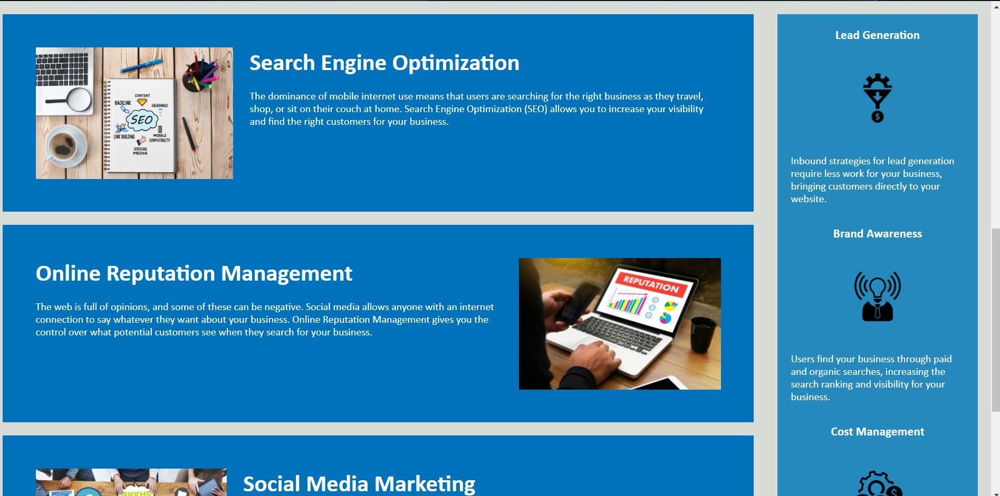
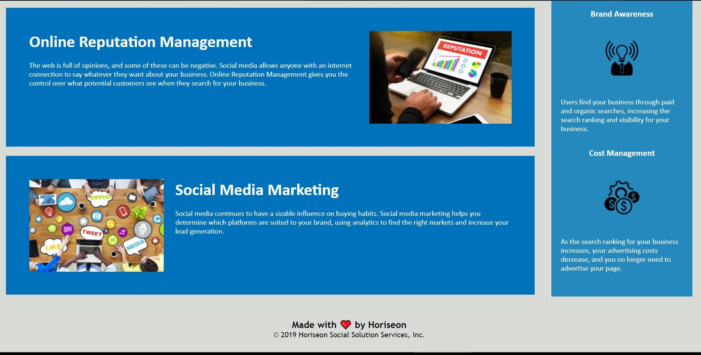

# Horiseon code refactor project

## Requirements

GIVEN a webpage meets accessibility standards  
WHEN I view the source code  
THEN I find semantic HTML elements  
WHEN I view the structure of the HTML elements  
THEN I find that the elements follow a logical structure independent of styling and positioning  
WHEN I view the image elements  
THEN I find accessible alt attributes  
WHEN I view the heading attributes  
THEN they fall in sequential order  
WHEN I view the title element  
THEN I find a concise, descriptive title  

## Files & directories

-horiseon-code-refactor  
    -Develop  
      -assets  
        -css  
          -style.css  
        -images  
          -brand-awareness.png  
          -cost-management.png  
          -digital-marketing-meeting.jpg  
          -lead-generation.png  
          -online-reputation-management.jpg  
          -search-engine-optimization.jpg  
          -social-media-marketing.jpg  
      -index.html  
    -.gitignore  
    -horiseon1.jpg  
    -horiseon2.jpg  
    -horiseon3.jpg  
    -README.md  

## Project Notes

this webpage html has been refactored to include sematic elements, and css styles consolidated.
i have added comments, alt attributes, and reconfigured the flow of the page to meet quality and accessibility standards.

## Screenshots

## Link

[link](https://github.com/mo9399/horiseon-coderefactor/blob/main/index.html)

## Credits

-Mohamed Abdullahi 
